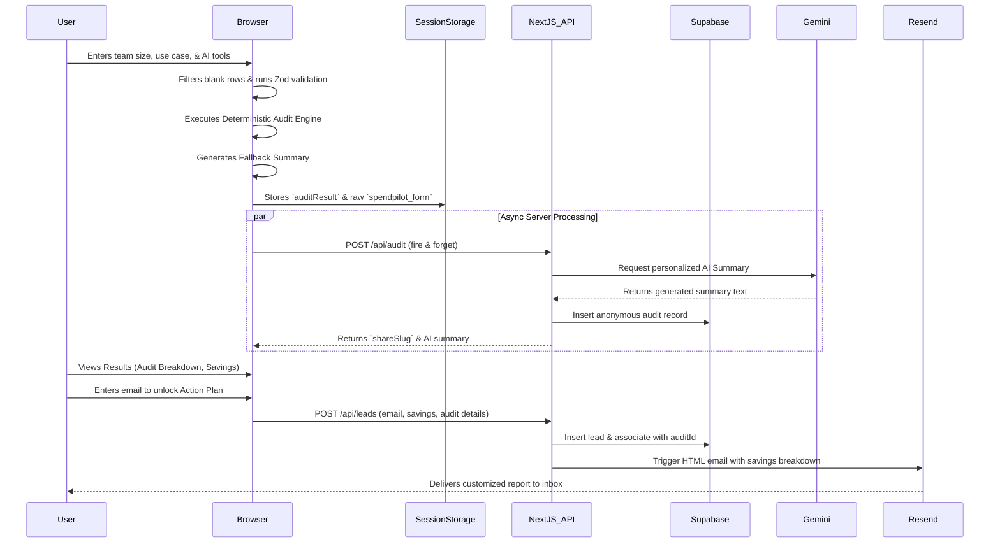

# System Architecture

## Core Data Flow Diagram

## Data Flow Narrative
1. **Intake:** The user builds a dynamic list of AI tools. Form validation guarantees only complete rows (tool + plan selected) pass.
2. **Local Processing:** The deterministic audit engine calculates exact financial metrics entirely in the browser to guarantee zero-latency results.
3. **Enhancement:** A background fetch requests an enhanced narrative summary from the Gemini API and saves the session to Supabase.
4. **Fulfillment:** Lead capture data is sent to a secure Next.js API route using a Service Role Key (bypassing RLS for secure insertion) and triggers a beautifully formatted transactional email via Resend.

## Technology Stack Reasoning
- **Next.js 14 (App Router):** Chosen for its ability to seamlessly combine a highly interactive React client with secure serverless API routes in a single deployment.
- **Supabase:** Provides an instant Postgres database with robust Row Level Security (RLS), allowing us to store anonymous audits safely while using a Service Key for sensitive lead captures.
- **React Hook Form + Zod:** Chosen for strict type safety and performance. RHF prevents unnecessary re-renders during complex array manipulations.
- **Framer Motion:** Adds essential micro-interactions and "wow-factor" glassmorphism animations necessary to build trust in a B2B SaaS tool.
- **Resend:** Selected over SendGrid/Mailgun for its modern developer experience, speed, and native React Email support.

## Scaling Considerations (10k Audits/Day)
If SpendPilot scaled to 10,000 audits per day, the current architecture would face three bottlenecks:
1. **Database Connections:** We would need to implement PgBouncer or Supabase's built-in connection pooling to prevent Next.js serverless cold starts from exhausting the Postgres connection limit.
2. **Rate Limiting:** The current in-memory rate limiter (`rateMap` in API routes) resets on every serverless function instance. We would migrate to an Upstash/Redis-based rate limiter to enforce strict global IP-based rate limiting to prevent API abuse.
3. **Queueing Emails:** At 10k/day, calling the Resend API synchronously during the `/api/leads` request could cause timeouts. We would move email dispatch to a background queue (like Inngest or Trigger.dev) to ensure the client-side API response remains under 200ms.
