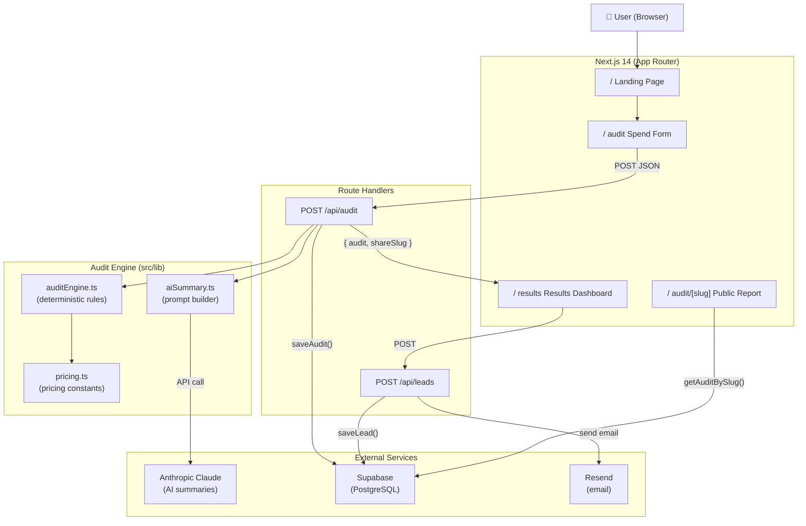

# ARCHITECTURE.md — SpendPilot System Design

## Architecture Diagram



---

## Data Flow

1. User fills Spend Form → client POSTs to `/api/audit`
2. Route Handler validates input with Zod
3. `runAudit()` evaluates 6 deterministic rules per tool
4. Claude API generates a ~100-word personalized summary (fallback if unavailable)
5. Result saved to Supabase (`audits` + `audit_tools` tables)
6. Response returned to client; stored in `sessionStorage`
7. User redirected to `/results` — reads from `sessionStorage`
8. After 3s, lead capture modal appears → POST `/api/leads`
9. Lead saved to Supabase with duplicate prevention
10. Confirmation email sent via Resend

---

## Database Schema

```sql
-- Run in Supabase SQL editor

create table audits (
  id uuid primary key,
  created_at timestamptz default now(),
  team_size int not null,
  use_case text not null,
  total_monthly_spend numeric not null,
  total_optimized_spend numeric not null,
  total_monthly_savings numeric not null,
  total_annual_savings numeric not null,
  savings_percentage int not null,
  ai_summary text,
  share_slug text unique not null
);

create table audit_tools (
  id uuid primary key default gen_random_uuid(),
  audit_id uuid references audits(id) on delete cascade,
  tool_name text not null,
  current_plan text not null,
  current_monthly_spend numeric not null,
  current_seats int not null,
  recommended_plan text not null,
  recommended_monthly_cost numeric not null,
  monthly_savings numeric not null,
  annual_savings numeric not null,
  action text not null,
  reason text not null,
  recommendation_type text not null,
  priority text not null
);

create table leads (
  id uuid primary key default gen_random_uuid(),
  created_at timestamptz default now(),
  email text not null,
  company_name text,
  role text,
  team_size int,
  audit_id uuid references audits(id),
  total_monthly_savings numeric not null
);

-- Row Level Security
alter table audits enable row level security;
alter table audit_tools enable row level security;
alter table leads enable row level security;

-- Public read for audits (for shared reports)
create policy "Public audits read" on audits for select using (true);

-- Service role full access for everything
```

---

## Scaling Considerations

| Concern | Current approach | At scale |
|---|---|---|
| Rate limiting | In-memory (per-process) | Redis + Upstash |
| AI summaries | Synchronous in request | Background job queue |
| Session storage | `sessionStorage` | Supabase or Redis |
| Audit persistence | Per-request | Async with retry |

---

## Stack Decisions

- **Next.js 14 App Router**: Collocated API routes, RSC for shared reports, Vercel-native
- **Tailwind CSS v3**: Well-tested, no v4 breaking changes risk
- **Supabase**: Postgres + auth + RLS in one; free tier generous for MVP
- **Anthropic Claude**: Best writing quality for financial summaries; haiku model is fast and cheap
- **Resend**: Developer-first, excellent deliverability, simple API
- **Vitest**: Fast ESM-native test runner; shares Vite's config ecosystem
